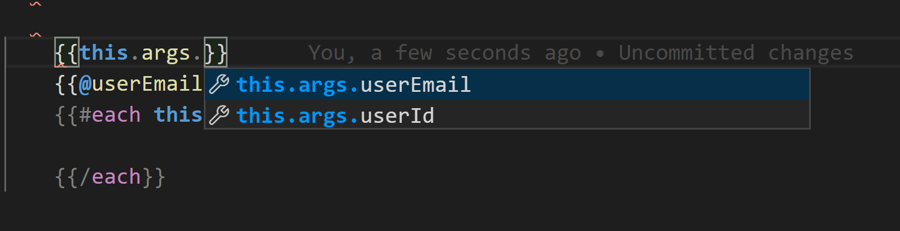
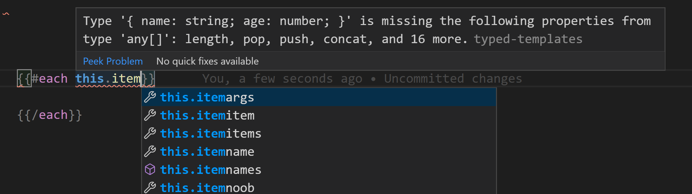
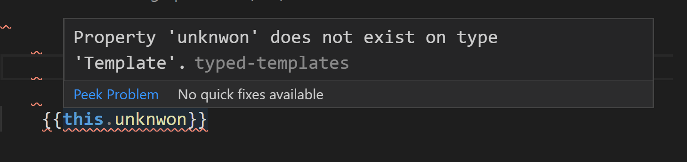

# els-addon-typed-templates
Ember Language Server Typed Templates Addon

How to use?

Install this addon as `dev-dependency` inside your ember project.

How typed template looks under the hood?
[issue-351282903](https://github.com/lifeart/els-addon-typed-templates/pull/11#issue-351282903)

* route templates not supported (yet);

### Autocomplete



### Warn Each




### Unknown Property


### Features

* Component context autocomplete `{{this.}}`
* Component arguments autocomplete `{{@}}`
* Warn on undefined properties (on complete)
* Warn on incorrect `each` arguments (not an array)

### NPM
`npm install els-addon-typed-templates --save-dev`

### Yarn
`yarn add els-addon-typed-templates --dev`

### VSCode

For `els-addon-typed-templates` >= `v3.0.0`, required `Unstable Ember Language Server` `>= v1.4.2`

For `els-addon-typed-templates` <= `v2.2.18`, required `Unstable Ember Language Server` `>= v0.2.57`

Install: [Unstable Ember Language Server](https://marketplace.visualstudio.com/items?itemName=lifeart.vscode-ember-unstable)

* Restart `VSCode`.

## Usage

Try type `{{this.}}` or `{{@}}` inside component template.

### Typescript Components

A component.ts file will work with no changes needed.

### Template Only Components

A template only component needs some additional information.

Note: This is also how Javascript/ JSDoc template only components work.

```hbs
{{!-- 
    interface Args {
        foo: {
            bar: string
        }
    }
--}}
{{@foo.bar}}
```

or 

```hbs
{{!--
  <script @typedef>
    interface Args {
      foo: {
        bar: string
      }
    }
  </script>
--}}
{{@foo.bar}}
```

### Javsacript Component (JSDoc)

A component.js file needs some additional information in the js file to work.

`components/cart.js`
```js
/**
 * @typedef {import('./../services/cart').default} CartService
 * 
 * @typedef {Object} Args
 * @property {string} foo
 * @property {import('./../models/bar'} bar
 * @extends Component<Args>

 */
export default class CartComponent extends Component {
    /**
     * CartService
     * @type {CartService}
     */
    @service('cart') cart;
}
```

`components/cart.hbs`
```hbs
{{#each this.cart.items as |item|}}
    {{item.name}} 
    // ^ will support autocomplete and linting
{{/each}}

{{@bar.price}}
// ^ will support autocomplete and linting
```

## FAQ

### How can I ignore lines?

 - use handlebars comments

```hbs
{{!-- @ts-ignore --}} 
{{this.line.to.ignore}}
```

### How can I ignore a file?

```hbs
{{!-- @ts-nocheck --}}
```

### How can I override/ extend global typings?

```ts
// + project/types/index.d.ts
declare module "ember-typed-templates" {
    interface GlobalRegistry {
		// helper, component, modifier name -> result
        'unknown-helper': (params: string[], hash?)=> string,
        'block': (params?, hash?) => [ { someFirstBlockParamProperty: 42 } ]
    }
}
```


### Errors and possible fixes:

https://github.com/lifeart/els-addon-typed-templates/pull/20

### Is it supposed to support Object.extend notation?

Nope

### Would it be possible to add these as dependencies to the language server or something similar?

Nope, because it's "experimental" and "heavy" functionality, adding it into language server itself may decrease DX for other users. UELS has addon API, using this addon API you able add functionality into langserver. All addons scoped inside projects (to allow users have multple addon versions for different ember projects and versions).

### Is it stable?

Sometimes it may crash your language server, don't worry it will awake automatically.
